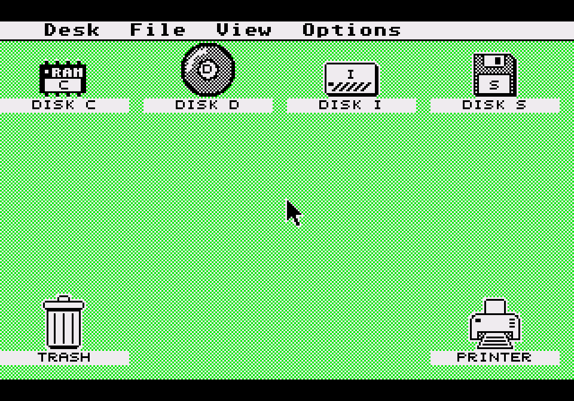
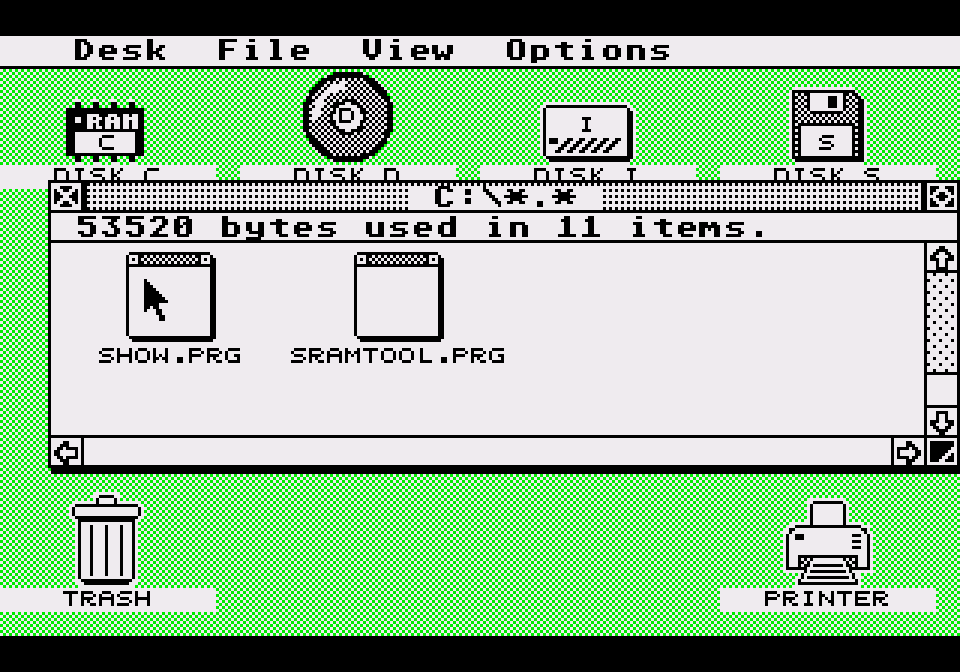
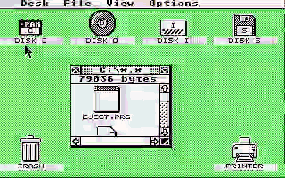

# EmuTOS on the Sega Mega CD

An Atari ST desktop on a Mega CD, booting from CD-R or cartridge.

    Mega CD sub 68000            Genesis main 68000
    EmuTOS, GEMDOS, AES, VDI  →  iofw: planar → VDP, pads → IKBD
    four block devices           serial keyboard, printer, sound

| | |
|---|---|
|  |  |
| `C:` in a GEM window | `SHOW.PRG` displaying `DEMO.PI1` — the Mandelbrot set, which `tools/mkpi1.py` computes. |

## Drives

| | |
|---|---|
| `C:` | ramdisk, system drive |
| `D:` | the disc (disc boot only) |
| `I:` | internal backup RAM, 8 KB |
| `S:` | cartridge save RAM or CD Backup RAM Cart |

Options → Save Desktop writes to `I:`, which both boots read. `I:` and
`S:` use Sega's backup RAM format, so game saves and EmuTOS files share
the cart — see `docs/bram-filesystem.md`.

The disc carries a picture viewer, a text editor, formatters and a
backup tool; `readme.txt` on C: lists them. `PRN:` is a printer on the
EXT port — see `docs/printer.md` and `hardware/pico-printer/`.

## Running it

Burn the `.cue`/`.iso` (slow burns read more reliably on real hardware),
or flash `m1emu.bin` and leave the tray empty. The disc is region-locked,
the cartridge is not.

Build instructions, including how to add Sonic: [docs/build.md](docs/build.md).

## Sonic

*Shown at twice actual speed.* **Desk → Sonic** is the whole interface —
an accessory rather than a `.PRG`, because a program launched from the
desktop is handed the screen, and the desktop he was standing on would
be gone. Start ends it; so does the signpost at the end of the fourth
screen.

He is not on the released disc and cannot be: the art and the movement
constants are Sega's. What the repository carries is the pipeline that
reads them out of dumps you already own — see
[docs/sonic.md](docs/sonic.md) for what that port had to solve.

## Layout

| | |
|---|---|
| `emutos/` | EmuTOS, `segacd` branch (submodule) |
| `patches/emutos/` | the same history as patch files |
| `iofw/` | the Genesis-side servant |
| `boot/` | IP, SP, security blocks, Mode 1 cartridge |
| `progs/` | the `.PRG`s and the accessory |
| `payload/` | Genesis-side payloads |
| `tools/` | build scripts, emulator harness |
| `docs/` | documentation |

## UNTESTED
pico Printer bridge
## TODO
MegaKey -- pico keyboard bridge for those without UART
