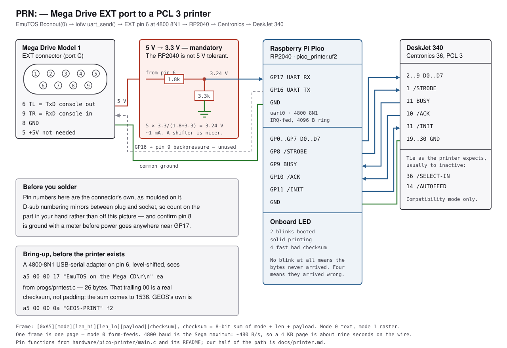

# The other end of the wire

`PRN:` on this machine is the Genesis EXT connector at 4800 8N1. This is
what is on the far side of it: an RP2040 that deframes the stream and
drives an HP DeskJet 340 -- or any PCL 3 printer -- over Centronics.

    EmuTOS (sub CPU)  ->  iofw (main CPU)  ->  EXT port  ->  Pico  ->  DeskJet
    Bconout(0, c)         uart_send()         4800 8N1      PCL 3    parallel

The firmware is **GEOS-Genesis's**, unmodified, and that is the point:
the frame is its frame, so the printer does not know or care which of the
two operating systems is talking to it. `main.c`, `CMakeLists.txt`,
`build.sh` and the prebuilt `pico_printer.uf2` are byte-for-byte as they
arrived. `docs/printer.md` is our side.

Keeping it verbatim is deliberate. Editing it would fork the wire
protocol, and the whole reason `emutos/bios/segacd.c` and `iofw/main.c`
speak this frame rather than one of their own is so that there is only
ever one of it.

The rest of that driver -- its EXT-UART sender, its screen packer, its
desktop wiring and its self-tests -- is GEOS-side and is not here,
because this machine has its own sender and its own desktop. This
directory is the half that is hardware rather than software, and it is
the half both systems share.

## The frame, and where the halves meet

    [0xA5 sync][mode][len_hi][len_lo][payload...][checksum]

    checksum = 8-bit sum of mode + len_hi + len_lo + payload
    mode 0   = text   -- ESC E, the ASCII, form feed
    mode 1   = raster -- [w_hi][w_lo][h_hi][h_lo][rows], 1bpp MSB first,
                         ceil(w/8) bytes a row, bit 1 = black

One frame is one page: mode 0 form-feeds at the end, which is why
`segacd_bconout0()` buffers a page rather than streaming bytes.

The deframer resyncs by scanning for `0xA5`, so a half-frame -- a reset
mid-page, a cable pulled -- costs that page and nothing after it.

We send mode 0 today. Nothing generates mode 1 yet: `Prtblk` is
`xbios_unimpl` in EmuTOS and there is no `v_hardcopy`, so there is no
screen dump to frame. The firmware has always been ready for it.

## Wiring

The diagram is `wiring.svg`, and it is drawn from the tables below and
from the `#define`s at the top of `main.c` -- nothing in it is a guess.
It did not come with the driver; the driver had these tables and no
picture.

Genesis EXT (DE-9), Model 1. Pin 6 is TL, which is TxD when the serial
engine has it; pin 9 is TR, which is RxD.

| EXT pin | signal | Pico |
|---|---|---|
| 6 | TL = TxD, Genesis out | UART RX = **GP17**, *through a level shifter* |
| 9 | TR = RxD, Genesis in | UART TX = GP16 (unused by us; see below) |
| 8 | GND | GND |

**The Genesis I/O is 5V TTL and the RP2040 is not 5V tolerant.** A
shifter or a divider (1.8k/3.3k) on pin 6 -> GP17 is not optional. 3.3V
out of GP16 generally reads as a 1 on a 5V TTL input, but a shifter is
safer there too.

Pico -> DeskJet 340, Centronics compatibility mode:

| Pico | Centronics | dir |
|---|---|---|
| GP0..GP7 | D0..D7 (pins 2..9) | out |
| GP8 | /STROBE (pin 1) | out |
| GP9 | BUSY (pin 11) | in |
| GP10 | /ACK (pin 10) | in |
| GP11 | /INIT (pin 31) | out |
| GND | GND (pins 19..30) | -- |

Tie /SELECT-IN (36) and /AUTOFEED (14) as the printer expects. All of
these are `#define`s at the top of `main.c`.

## Flashing

Hold BOOTSEL, plug the Pico in, drop `pico_printer.uf2` on the RPI-RP2
drive. That is the whole of it -- the `.uf2` here is prebuilt.

To build it instead you need `cmake` and `gcc-arm-none-eabi`, and the
Pico SDK 1.5.1. `build.sh` and `CMakeLists.txt` look for it at
`vendor/pico-sdk` relative to the repo root, or wherever `PICO_SDK_PATH`
points. **The SDK is not vendored here** -- it is gitignored like the
rest of `vendor/`, so `./build.sh` on a fresh clone will not find one
until you put it there or set the variable. Nothing in this project
needs building it; the firmware ships flashed-ready.

## The LED

Two blinks at boot, solid while a page prints, four fast blinks on a
checksum or format error. That is the only diagnosis the bridge offers
and it is worth knowing before wiring anything: four blinks means the
bytes arrived and were wrong, no blinks at all means they never arrived.

## Bring-up before any printer exists

Point a 4800-8N1 USB-serial adapter at EXT pin 6, level-shifted, and
print from the desktop. `progs/prntest.c` emits

    a5 00 00 17 "EmuTOS on the Mega CD\r\n" ea

-- 28 bytes, and the trailing `ea` is a real checksum, not padding.
GEOS's own bring-up packet is
`a5 00 00 0a "GEOS-PRINT" f2`, and both are the same arithmetic, which
is the cheapest possible check that the two senders agree.

## One interop note

`RING_SZ` is 4096 and the ring drops on overflow. Our page is 4096 bytes
of payload plus five of framing, and the bridge buffers a whole frame
before it starts printing -- so during a page the consumer is draining
and the ring is never the limit. Two maximum-size pages sent back to
back are the case where it could be: the second one arrives while the
first is still going through the Centronics handshake. At 480 bytes a
second a page takes about nine seconds to send and a DeskJet 340 takes
longer than that to print one, so the wire is the slower half and this
has never been reached. It is written down because it is the one place
the two sides' buffer sizes have to be read together, and `RING_SZ` is a
one-line change in `main.c` if it ever is.
